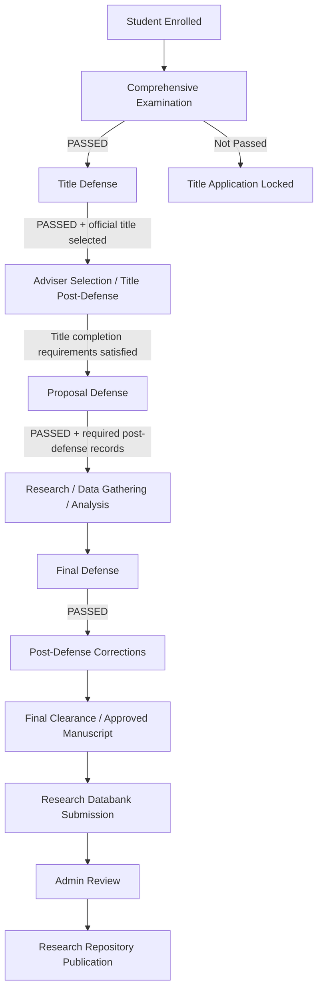
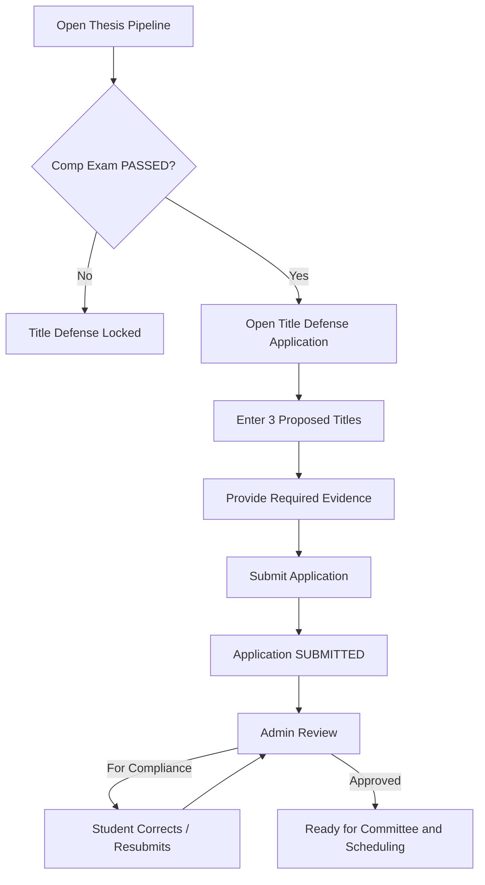
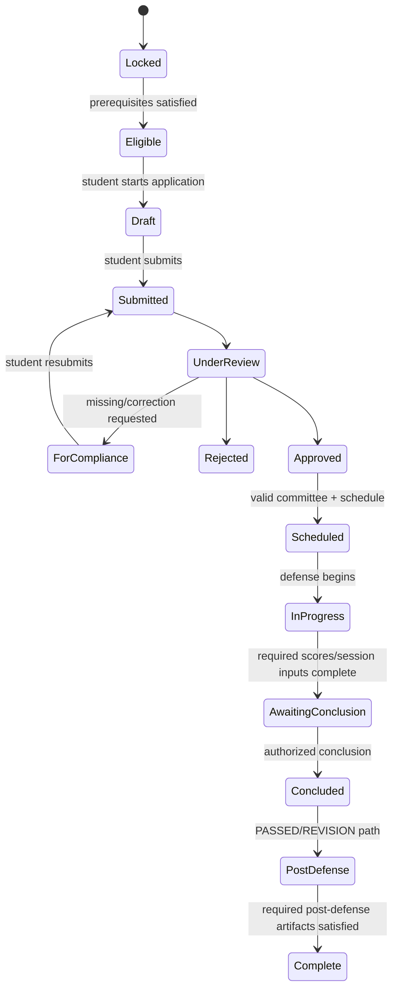

# EARIST Graduate School Thesis & Dissertation Workflow
## Canonical System Specification / Source of Truth

**System:** EARIST Graduate School Information System (GS-IS)  
**Campus Context:** Eulogio "Amang" Rodriguez Institute of Science and Technology (EARIST), Manila Campus  
**Scope:** Graduate Student Thesis / Dissertation workflow  
**Target Implementation Branch:** `refactor/defense-workflow`  
**Document Status:** Draft for client validation; authoritative for refactor where marked **CONFIRMED**  
**Version:** 1.4-draft  
**Last Updated:** 2026-09-24  

---

## 1. Purpose

This document is the canonical functional and UX specification for the Graduate School thesis/dissertation workflow in GS-IS.

It exists to prevent the implementation from drifting between:

- old workflow documents,
- old UI/UX specifications,
- legacy EARIST thesis/dissertation rules,
- current client clarifications,
- current source-code behavior, and
- newer research about EARIST operations.

The system should be refactored against this document rather than against the current implementation alone.

### 1.1 Core rule

> **Documentation is updated before workflow code whenever a client-confirmed rule changes.**

A pull request that changes defense eligibility, committee composition, application statuses, scoring, conclusion, RAP processing, or stage progression should update this document in the same change.

---

## 2. Source-of-Truth Hierarchy

When two sources conflict, use the higher-priority source.

| Priority | Source | Usage |
|---:|---|---|
| 1 | **Current explicit EARIST client confirmation** | Highest authority for current operations. |
| 2 | **Current EARIST forms / screenshots / actual office procedures provided by client** | Defines real forms, signatories, fields, and operational steps. |
| 3 | **Current official EARIST public information** | Used to validate programs, offices, fees, and currently published institutional information. |
| 4 | **This canonical specification after client validation** | Engineering and UI/UX source of truth. |
| 5 | **Legacy EARIST thesis/dissertation manual** | Historical workflow evidence only. Do not hard-code legacy counts/rules when newer client rules conflict. |
| 6 | **Old project workflow / UIUX references** | Useful design history, but superseded where this document differs. |
| 7 | **Current implementation behavior** | Never treated as policy merely because code already does it. |

### 2.1 Rule-confidence tags

Rules in this document may be annotated with:

- **CONFIRMED_CLIENT** — directly confirmed by the current client.
- **CONFIRMED_PROJECT_SCOPE** — deliberate implementation/scope decision accepted for the current project, even when it is not an institutional policy claim.
- **SUPPORTED_CURRENT** — supported by current official/public information and/or current operational evidence.
- **SUPPORTED_CURRENT_PUBLIC_GUIDANCE** — supported by current EARIST Graduate School public requirement guidance/posters supplied to the project.
- **SUPPORTED_LEGACY** — supported by legacy EARIST documentation but not yet reconfirmed.
- **PROJECT_REFERENCE** — present in the old project documentation.
- **PROPOSED_SYSTEM_DESIGN** — engineering/UX design intended to safely represent the workflow.
- **OPEN_QUESTION** — must not be silently hard-coded until confirmed.

---

## 3. Important Corrections to the Old References

The old documents remain useful, but the following points must be interpreted correctly.

### 3.1 Comprehensive Examination

The Comprehensive Examination is **not** a prerequisite for Student account creation. A student may retain portal access regardless of the Comprehensive Exam result.

However, the Comprehensive Examination **is a thesis/dissertation eligibility gate**:

> A student must have a recorded **PASSED** Comprehensive Examination before filing a Title Defense application.

Therefore these two statements are both true:

1. Comprehensive Exam failure does not disable the Student account.
2. Comprehensive Exam PASS is required to start the formal defense track.

**Status:** SUPPORTED_LEGACY + current project/client workflow.

### 3.2 Adviser before Title Defense

The current client clarification used by the project is:

> **Title Defense application does not require an adviser.**

After a Title Defense is formally concluded as `PASSED` and one official title is selected, the student may begin the Adviser Request process. The current client further clarified that the student's adviser must be chosen from the student's own Title Defense panel rather than from the full faculty/adviser directory.

For current GS-IS terminology:

- **Defense Committee** means the complete assigned defense roster, including evaluators and session-support roles.
- **Oral Defense Panel (ODP)** means the evaluative subset used for academic evaluation and, under the adviser-selection rule, the adviser candidate pool.
- The working role mapping is **Chairman + evaluator Panelists** for the ODP, with Facilitator and Rapporteur excluded from adviser candidacy. The exact current role-label mapping remains subject to explicit client confirmation.

An active adviser is required before Proposal/Final eligibility under the current design, but adviser selection itself may begin after a passed Title Defense and official-title selection; it does not need to wait for every later Title post-defense artifact.

**Status:** Adviser not required for Title and adviser must come from the student's own Title Defense panel are **CONFIRMED_CLIENT**. The exact `CHAIRMAN`/`PANELIST` role mapping to the current ODP is **PROPOSED_SYSTEM_DESIGN / OPEN_QUESTION**, supported by legacy EARIST adviser-selection wording.

### 3.3 Committee size


The old EARIST manual describes a smaller historical Oral Defense Panel. That composition must **not** be used for the current system.

The client verbally clarified:

- Master's: **5 panelists + 1 facilitator + 1 rapporteur = 7 participants**
- Doctoral: **6 panelists + 1 facilitator + 1 rapporteur = 8 participants**

The current 2025 official application forms provide a more specific role layout:

| Program Type | Current form evidence | Session total shown |
|---|---|---:|
| Master's — EARIST-QSF-GS-006 Rev. 01 (06.20.25) | **Adviser + 4 rows labeled Panelist + Facilitator + Rapporteur** | **7** |
| Doctoral — EARIST-QSF-GS-007 Rev. 01 (06.20.25) | **6 rows labeled Panelist + Facilitator + Rapporteur** | **8** |

These sources agree on the **7/8 total**, but the Master's verbal phrase “5 panelists” is not identical to the printed role labels “Adviser + 4 Panelist.” Therefore the system must **not yet hard-code 5 Master's scorers/evaluators**. The current forms should be used to clarify whether the client meant a five-person academic committee that includes the Adviser, or five scoring panelists in addition to the Adviser.

The Oral Examination Summary Sheet (EARIST-QSF-GS-011 Rev. 01) separately places the **Thesis/Dissertation Adviser under “Concurred In”**, outside the “Panel of Examiners” / Chairman + Member signature block. This supports modeling Adviser participation separately from evaluator participation; it does not by itself prove whether the Adviser scores in every defense stage.

**Status:** 7/8 session totals are CONFIRMED_CLIENT + SUPPORTED_CURRENT_FORM. Exact evaluator/adviser counting remains OPEN_QUESTION.

### 3.4 Application approval is not defense completion

These states must never be treated as equivalent:

- application approved,
- defense scheduled,
- evaluator scores complete,
- defense formally concluded,
- defense passed,
- RAP finalized,
- stage complete.

The next academic stage may unlock only when the required completion conditions for the prior stage are satisfied.

---

## 4. Canonical Graduate Research Lifecycle

The thesis/dissertation research journey is one continuous research project containing three defense stages.



### 4.1 Canonical sequence

1. Student account is active after enrollment/COR process.
2. Comprehensive Exam is conducted externally/manual and result is recorded by Admin.
3. Comprehensive Exam must be **PASSED** to unlock Title Defense filing.
4. Student files Title Defense application.
5. Admin reviews application requirements.
6. Approved application enters committee assignment and scheduling.
7. Title Defense is conducted.
8. Evaluator scores and session notes are completed.
9. Authorized conclusion records the official defense outcome.
10. For a passed Title Defense, one of the three proposed titles is selected as the official research title.
11. Adviser Request becomes available; the student selects an eligible adviser candidate from the student's own Title Defense ODP.
12. Adviser CONFORME/acceptance and Dean approval are completed before an active `AdviserAssignment` is created.
13. Required Title post-defense records/RAP and remaining Proposal prerequisites are completed.
14. Student files Proposal Defense application.
15. Proposal is reviewed, scheduled, conducted, and formally concluded.
16. Proposal post-defense requirements/RAP are completed.
17. Student completes research/data gathering/analysis and Final requirements.
18. Student files Final Defense application.
19. Final is reviewed, scheduled, conducted, and formally concluded.
20. Student completes post-defense corrections and final certifications.
21. Approved final research is submitted to the databank.
22. Admin approves repository publication.

---

## 5. Domain Model Principle: One Research Project, Multiple Defense Events

The system should not conceptually treat Title, Proposal, and Final as unrelated thesis records.

Recommended domain structure:

```text
GraduateResearchProject
├── Student
├── Program / Program Type
├── Proposed Titles
├── Official Selected Title
├── Adviser Relationship(s)
├── Title Defense Application / Session / Outcome
├── Proposal Defense Application / Session / Outcome
├── Final Defense Application / Session / Outcome
├── Requirement Evidence
├── RAP Reports / Signatures
├── Research Variables
├── Plagiarism Results
├── Post-Defense Corrections
└── Databank / Repository Record
```

**PROPOSED_SYSTEM_DESIGN:** The implementation may retain an existing table during migration, but the domain logic must preserve this one-project / many-stage-events model.

---

## 6. Status Architecture

The current implementation overloads `ThesisRecord.status`. The refactor should separate concerns.

### 6.1 Application Status

Represents administrative review of one stage's application.

```text
DRAFT
  ↓
SUBMITTED
  ↓
UNDER_REVIEW
  ├──→ FOR_COMPLIANCE ──→ RESUBMITTED ──→ UNDER_REVIEW
  ├──→ REJECTED
  └──→ APPROVED
```

Recommended enum:

```text
DRAFT
SUBMITTED
UNDER_REVIEW
FOR_COMPLIANCE
APPROVED
REJECTED
WITHDRAWN
```

**Note:** `FOR_COMPLIANCE` is recommended instead of using `REJECTED` for every missing document. Final terminology should follow client preference.

### 6.2 Defense Session Status

Represents the actual scheduled defense event.

```text
UNSCHEDULED
SCHEDULED
RESCHEDULED
IN_PROGRESS
AWAITING_CONCLUSION
CONCLUDED
CANCELLED
```

### 6.3 Academic Defense Outcome

Represents the official result after formal conclusion.

Current project outcomes:

```text
PASSED
REVISION_REQUIRED
FAILED
```

**OPEN_QUESTION:** Determine whether EARIST distinguishes `REVISION_REQUIRED` from `REDEFENSE_REQUIRED`, and exactly how a revision is cleared.

### 6.4 RAP Status

Recommended:

```text
NOT_CREATED
DRAFT
FOR_SIGNATURE
PARTIALLY_SIGNED
FINALIZED
DISTRIBUTED
```

### 6.5 Stage Completion

A defense stage is **not complete** merely because it is passed.

Recommended derived state:

```text
NOT_STARTED
ELIGIBLE
APPLICATION_IN_PROGRESS
DEFENSE_IN_PROGRESS
POST_DEFENSE_IN_PROGRESS
COMPLETE
BLOCKED
```

A stage becomes `COMPLETE` only when its formal outcome and required post-defense artifacts are satisfied.

---

## 7. Non-Negotiable State Invariants

These are engineering rules, not UI suggestions.

1. `APPLICATION.APPROVED` must never imply `DEFENSE.PASSED`.
2. `DEFENSE.SCHEDULED` must never imply `DEFENSE.PASSED`.
3. Completion of evaluator scores must never directly mutate the official academic outcome.
4. A defense outcome may be recorded only by the authorized conclusion action.
5. Title Defense cannot be concluded as passed without a valid selected title from the student's submitted title proposals.
6. Proposal cannot unlock merely because Title application was approved.
7. Final cannot unlock merely because Proposal application was approved.
8. Non-evaluator roles must not submit evaluator scores unless client policy explicitly says otherwise.
9. Stage-specific requirements must be validated against the correct defense stage, not merely against any historical file on the research project.
10. RAP generation should occur from the formal conclusion flow, not independently from score submission.
11. The same person must not be assigned twice to the same defense unless the client explicitly permits multiple functional roles for one person.
12. Scheduling must validate committee composition server-side.
13. Frontend requirement badges are informational; backend/domain rules are authoritative.
14. Adviser Request after Title Defense must derive candidates from the student's own passed Title Defense ODP, not from the unrestricted faculty directory.
15. A requested adviser must not become an active `AdviserAssignment` until the required Adviser CONFORME/acceptance and Dean approval sequence is complete.

---

## 7.1 Requirement Responsibility Classification

Every defense requirement must be classified before implementation so the system does not turn every paper-office instruction into an unnecessary upload field.

| Classification | Meaning | Example | System behavior |
|---|---|---|---|
| **SYSTEM_DATA** | Structured data the system must keep/query | Three proposed title names, defense stage, selected title | Store as structured fields/records |
| **SYSTEM_UPLOAD** | Student/user provides a file required by the digital workflow | Title proposal package PDF, Chapters 1–3, Chapters 1–5, proof of payment | Upload, validate, review, stage-scope |
| **SYSTEM_GENERATED_DOCUMENT** | Official form can be generated from existing system data | GS-006/GS-007, GS-011 | Generate/preview/print; implementation may be deferred |
| **EXTERNAL_MANUAL** | Process happens outside GS-IS; system may only retain evidence | Cashier payment, external expert evaluation | Do not recreate the outside process; store proof only when required |
| **PHYSICAL_GS_OFFICE** | Physical packaging/copy requirement handled at the GS Office | Long brown envelope, sliding folder, ring-bound manuscript | Show as instruction or optional office checklist; do not require a digital upload solely for the physical item |
| **CLIENT_CONFIRMATION_REQUIRED** | Conflicting/current evidence is insufficient | STRIKE/statistician/instruments as Final gate | Do not hard-code as canonical eligibility until reconfirmed |

**Canonical rule:** the system models the decision/evidence EARIST needs, not the physical container used to carry that evidence.

---

# PART II — DEFENSE STAGES

## 8. Stage A — Title Defense

### 8.1 Purpose

The student presents three proposed research titles. The defense determines the approved research direction/title.

### 8.2 Entry Gate

Current EARIST Graduate School Stage #1 public guidance supports the following working interpretation.

| Requirement | Classification / Representation | Rule Status |
|---|---|---|
| Student exists and is enrolled | SYSTEM_DATA — Student record | SUPPORTED_CURRENT |
| Comprehensive Exam = PASSED | SYSTEM_DATA — Comp Exam record | SUPPORTED_LEGACY + current project rule + SUPPORTED_CURRENT_PUBLIC_GUIDANCE |
| No blocking active/duplicate research project | SYSTEM_DATA — research project | PROPOSED_SYSTEM_DESIGN |
| Three proposed research title names | SYSTEM_DATA — structured title records | SUPPORTED_CURRENT_PUBLIC_GUIDANCE |
| Title Defense proposal package | SYSTEM_UPLOAD — PDF/file containing the required supporting content for all three titles | SUPPORTED_CURRENT_PUBLIC_GUIDANCE + CONFIRMED_PROJECT_SCOPE |
| Current COR | SYSTEM_UPLOAD or linked current verified COR evidence scoped to this application/stage | SUPPORTED_CURRENT_PUBLIC_GUIDANCE |
| Defense fee receipt / proof of payment | SYSTEM_UPLOAD — proof issued by EARIST Cashier; payment itself occurs outside GS-IS | SUPPORTED_CURRENT_PUBLIC_GUIDANCE + CONFIRMED_PROJECT_SCOPE |
| Application Form | SYSTEM_GENERATED_DOCUMENT | Supported by current form; implementation **deferred from the core refactor** |
| Process Flow | SYSTEM_GENERATED_DOCUMENT / reference document | Current public guidance; implementation **deferred from the core refactor** |
| Long brown envelope / sliding folder | PHYSICAL_GS_OFFICE | SUPPORTED_CURRENT_PUBLIC_GUIDANCE; not a digital upload requirement |
| Adviser | — | **NOT REQUIRED for Title application** — CONFIRMED_CLIENT |

### 8.2.1 Title proposal content rule

The student does **not** manually encode Rationale, SOP, Hypothesis, Population, Research Locale, Student Profile, and similar academic content into separate GS-IS fields.

The system keeps only the three proposed title names as structured data because those names are needed later for defense display and official-title selection. The detailed supporting content remains inside the student's uploaded Title Defense proposal package.

```text
Structured system data
├── Proposed Title 1
├── Proposed Title 2
└── Proposed Title 3

Uploaded Title Defense proposal package
├── Title 1 supporting content
│   ├── Rationale of the Study
│   ├── SOP
│   ├── Hypothesis
│   ├── Population
│   ├── Research Locale
│   └── Student Profile / required profile content
├── Title 2 supporting content
└── Title 3 supporting content
```

The current implementation's `conceptPaper` upload can be retained during refactor, but the UI/domain label should be changed to something clearer such as **Title Defense Proposal Document** or **Three-Title Proposal Package**.

### 8.3 Student Flow



### 8.4 Admin Flow

1. Open Title Defense application review queue.
2. View student/program/degree type.
3. View Comprehensive Exam result from system record.
4. View three proposed titles.
5. Verify stage-specific requirements.
6. Return for compliance, reject, or approve.
7. Approved application appears in scheduling queue.
8. Build committee using program-specific policy.
9. Set date/time/venue or MS Teams link.
10. Notify student and assigned participants.

### 8.5 Conducting the Title Defense

During the defense:

- Only users designated as evaluators may submit scores/evaluations.
- Rapporteur captures required notes/minutes if that is the confirmed responsibility.
- Facilitator performs session facilitation and is non-evaluator by default.
- One submitted title is selected as the approved research title during formal conclusion.

### 8.6 Formal Conclusion

The system must not pass the Title stage merely because all scores are submitted.

```text
All required evaluator scores submitted
              ↓
       AWAITING_CONCLUSION
              ↓
Authorized user reviews:
- score summary
- evaluator recommendations
- rapporteur/session notes
- proposed titles
              ↓
Select official outcome
              ↓
If PASSED: select exactly one official title
              ↓
Create official conclusion record
              ↓
Create RAP workflow
```

### 8.7 Title Stage Completion

At minimum:

- official conclusion exists,
- official outcome is `PASSED`,
- exactly one approved title is recorded,
- required Title RAP/signatures are finalized,
- required Title post-defense records are complete.

Only then should Proposal readiness be evaluated.

**Adviser-selection timing:** Adviser Request may unlock earlier than full Title-stage completion once the Title Defense has been formally concluded as `PASSED` and an official title is selected. This does **not** unlock Proposal by itself; Proposal still requires the active approved adviser relationship plus the remaining Title completion requirements.

---

## 9. Adviser Selection / GS-020 Between Title and Proposal

The adviser relationship begins after the student's Title Defense has been formally passed; it is not a prerequisite for filing Title Defense.

### 9.1 Confirmed system rules

- Adviser is not required to file Title Defense. **CONFIRMED_CLIENT**
- Adviser selection becomes available after the student's Title Defense is formally `PASSED` and one official title has been selected. **CONFIRMED_CLIENT**
- The adviser must be selected from the student's own Title Defense panel, not from the unrestricted faculty/adviser directory. **CONFIRMED_CLIENT**, also consistent with legacy EARIST adviser-selection material.
- The current Adviser Request form, **EARIST-QSF-GS-020 Rev. 00 (06.20.25)**, represents Student request → Adviser **CONFORME** → Dean, Graduate School approval. **SUPPORTED_CURRENT_FORM**
- `AdviserAssignment` becomes active only after the configured Adviser acceptance/conforme and Dean approval sequence succeeds. **PROPOSED_SYSTEM_DESIGN**
- An active adviser remains required for Proposal and Final eligibility under the current design.

### 9.2 Defense Committee and Oral Defense Panel terminology

GS-IS should distinguish the full session roster from the evaluative adviser-candidate group.

```text
Defense Committee
├── Oral Defense Panel (ODP) / evaluators
│   ├── Chairman
│   └── Panelist / evaluator members
├── Facilitator
└── Rapporteur
```

For current system wording:

- **Defense Committee** — umbrella term for all formally assigned participants in the defense session.
- **Oral Defense Panel (ODP)** — evaluative subset of the Defense Committee used for academic evaluation and adviser candidacy after Title Defense.
- **Working role mapping:** `CHAIRMAN` + evaluator `PANELIST` assignments belong to the ODP; `FACILITATOR` and `RAPPORTEUR` do not.
- The client has confirmed that adviser selection is restricted to the student's Title Defense panel. The exact mapping of the current role labels to ODP membership should still be explicitly reconfirmed before treating the Chairman/Panelist split as institutional policy.

**Status:** Adviser-candidate restriction to the student's own Title Defense panel is **CONFIRMED_CLIENT**. ODP = Chairman + evaluator Panelists, excluding Facilitator/Rapporteur, is **PROPOSED_SYSTEM_DESIGN / OPEN_QUESTION** pending exact role confirmation.

### 9.3 Adviser candidate eligibility and data source

The adviser-selection screen must derive its candidates from the student's actual passed Title Defense session.

```text
DefenseConclusion
├── defenseType = TITLE_DEFENSE
├── outcome = PASSED
└── selectedTitleId exists
        ↓
Title DefenseSchedule / DefenseSession
        ↓
DefenseParticipantAssignment / PanelAssignment
        ↓
Filter to configured ODP/evaluator roles
        ↓
Eligible adviser candidates for this student
```

Rules:

1. Do not query the full faculty directory as the student's adviser-choice list.
2. Candidate users must come from the same Title Defense session that produced the passed conclusion.
3. Candidate accounts must still be active/eligible system users when the request is made.
4. Facilitator and Rapporteur are excluded under the current evaluator-only working design unless the client explicitly changes the rule.
5. The student may view useful faculty profile information already owned by GS-IS, such as name, specialization, and office/affiliation, before making the request.
6. Adviser-load or general `isAvailableAsAdviser` restrictions must not be silently hard-coded as institutional policy unless the current client confirms them.

### 9.4 Canonical adviser-request flow

```text
Title Defense formally PASSED
      ↓
Official Title selected
      ↓
Adviser Selection unlocked
      ↓
Student views eligible Title Defense ODP members
      ↓
Student selects one candidate and submits GS-020 Adviser Request
      ↓
Requested Adviser reviews request
      ├── DECLINES / returns → student may select another eligible ODP member
      └── CONFORMS / ACCEPTS
                ↓
Dean, Graduate School reviews
      ├── REJECTS / returns
      └── APPROVES
                ↓
AdviserAssignment becomes ACTIVE
                ↓
Student + Adviser notified
                ↓
Proposal preparation / stage-specific Adviser Certification
```

The Dean/Admin approval step must not silently substitute for Adviser CONFORME. Requested adviser and active adviser are different states.

### 9.5 GS-020 as system-native workflow + generated official document

GS-020 should be implemented as structured system workflow data first, with an official generated/downloadable form as its document output.

```text
Student request data
      ↓
Adviser CONFORME / decline
      ↓
Dean approval / rejection
      ↓
Final adviser-request record
      ↓
Generate current GS-020 from authoritative system data
      ↓
Preview / Download / Print official copy
```

Recommended behavior:

- The student should not be required to download a blank GS-020, fill it manually, and re-upload it as the primary workflow.
- GS-IS should prefill the official GS-020 from authoritative records: student identity, program, official title/research context when present, requested adviser, request date, Adviser CONFORME status/date, Dean approval status/date, and other confirmed form fields.
- A draft/pending preview may be shown while the request is incomplete.
- After final approval, the system should provide a finalized downloadable/printable GS-020 snapshot.
- Wet, digital, or mixed signature handling should follow the cross-cutting official-document architecture in Section 34 and the signature mode approved by EARIST.
- Finalized generated copies must remain immutable/reproducible for audit.

### 9.6 Critical modeling rules

> `AdviserRequest` / nomination is not the same record as an active `AdviserAssignment`.

> `AdviserAssignment` does not automatically mean `DefenseParticipantAssignment`.

The system should therefore keep:

```text
AdviserRequest
├── studentId
├── requestedAdviserId
├── sourceTitleDefenseSessionId / source ODP context
├── request status
├── adviserResponse / conformedAt
├── deanDecision / approvedAt
└── audit metadata

AdviserAssignment
├── studentId
├── adviserId
├── activatedFromRequestId
├── assignedDate
└── isActive
```

The exact Prisma shape may differ, but the domain distinction is required.

A later Proposal/Final defense may include the adviser in a different participant/signatory capacity according to that stage's confirmed committee/form rules. The prior Title ODP membership only determines adviser candidacy; it does not automatically assign the adviser to future defense sessions.

## 10. Stage B — Proposal Defense

### 10.1 Purpose

The student defends the research proposal, generally covering Chapters 1–3, research framework, methodology, and approved variables.

### 10.2 Entry Gate

Current EARIST Graduate School Stage #2 public guidance supports the following working interpretation.

| Requirement | Classification / Representation | Rule Status |
|---|---|---|
| Title stage formally completed | SYSTEM_DATA — prior conclusion + required post-defense completion | SUPPORTED_LEGACY / PROJECT_REFERENCE |
| Official selected title exists | SYSTEM_DATA — research title | SUPPORTED_LEGACY |
| Active adviser | SYSTEM_DATA — Adviser assignment | Current project rule |
| Proposal-stage Adviser Certification | SYSTEM_DATA / generated certification scoped to `PROPOSAL_DEFENSE` | SUPPORTED_CURRENT_PUBLIC_GUIDANCE + current form evidence |
| Finalized/approved Title RAP / Rapporteur's Report | SYSTEM_DATA — internal RAP reference; no duplicate upload when GS-IS already owns the authoritative record | SUPPORTED_CURRENT_PUBLIC_GUIDANCE / PROJECT_REFERENCE |
| Research Variables approval **if applicable** | SYSTEM_DATA — conditional applicability + internal variable form/status | SUPPORTED_CURRENT_PUBLIC_GUIDANCE |
| Manuscript Chapters 1–3 | SYSTEM_UPLOAD — proposal manuscript | SUPPORTED_CURRENT_PUBLIC_GUIDANCE |
| Current COR | SYSTEM_UPLOAD or linked current verified COR evidence scoped to this application/stage | SUPPORTED_CURRENT_PUBLIC_GUIDANCE |
| Defense fee receipt / proof of payment | SYSTEM_UPLOAD — proof issued by EARIST Cashier; payment itself occurs outside GS-IS | SUPPORTED_CURRENT_PUBLIC_GUIDANCE + CONFIRMED_PROJECT_SCOPE |
| Application Form | SYSTEM_GENERATED_DOCUMENT | Supported by current form; implementation **deferred from the core refactor** |
| Process Flow | SYSTEM_GENERATED_DOCUMENT / reference document | Current public guidance; implementation **deferred from the core refactor** |
| Long brown envelope / ring-bound manuscript | PHYSICAL_GS_OFFICE | SUPPORTED_CURRENT_PUBLIC_GUIDANCE; not a digital upload requirement |

### 10.3 Requirement provenance

The UI should distinguish:

**System-derived requirements**

- Title passed/completed
- selected title
- adviser assignment
- Title RAP finalized
- Research Variable approval **only when the research requires it**

**User-provided requirements**

- Chapters 1–3 / proposal manuscript
- current-stage proof of defense-fee payment from the Cashier
- current COR evidence when the system cannot safely link an already-verified current COR to this application

**Adviser/Admin-provided requirements**

- Adviser Certification
- requirement verification

**Physical GS Office requirements**

- long brown envelope
- ring-bound manuscript
- required photocopies/physical copies

These may be shown as instructions or tracked as received by GS staff if the client later requests office-checklist tracking, but they are not automatically student file-upload requirements.

### 10.3.1 Conditional Research Variables rule

The current Stage #2 public guidance says **“Letter for Approval of the Variables (IF ANY)”**. Therefore Research Variables must not be a universal Proposal gate.

Recommended domain behavior:

```text
Research variables approval applicable?
├── NO / NOT_APPLICABLE → requirement satisfied by N/A decision
└── YES → approved/signed variable record required
```

The current backend rule that blocks every Proposal application when `researchVariablesApproved == false` must be refactored so an explicit `NOT_APPLICABLE` state can satisfy the requirement.

### 10.4 Proposal Application Flow

```text
Title Stage COMPLETE
      ↓
Adviser Active
      ↓
Proposal Requirements Complete
      ↓
Student SUBMITS Proposal Application
      ↓
Admin UNDER_REVIEW
      ├─ FOR_COMPLIANCE → Student updates → Resubmit
      ├─ REJECTED
      └─ APPROVED
              ↓
Committee Assignment
              ↓
Schedule
              ↓
Proposal Defense
              ↓
Scores complete
              ↓
Formal Conclusion
              ↓
RAP / Required signatures
              ↓
Proposal Stage COMPLETE
```

### 10.5 Proposal Post-Defense

The old project references specify seven digital copies of Chapters 1–3 after Proposal Defense.

**Status:** PROJECT_REFERENCE / legacy operational rule.  
**Action:** Confirm whether this remains current and whether "7 digital copies" means seven separate uploaded files, one approved digital file distributed to seven recipients, or a carry-over from physical-copy procedure.

Do not model seven identical uploads until this is confirmed.

---

## 11. Stage C — Final Defense

### 11.1 Purpose

The student defends the complete research manuscript, generally Chapters 1–5.

### 11.2 Entry Gate

Current EARIST Graduate School Stage #3 public guidance supports the following baseline requirements. Older project references contain additional Final-stage requirements that are now treated as confirmation items rather than unquestioned gates.

| Requirement | Classification / Representation | Rule Status |
|---|---|---|
| Proposal stage formally completed | SYSTEM_DATA — prior conclusion + post-defense completion | SUPPORTED_LEGACY / PROJECT_REFERENCE |
| Active adviser | SYSTEM_DATA — Adviser assignment | Current project rule |
| Final-stage Adviser Certification | SYSTEM_DATA / generated certification scoped to `FINAL_DEFENSE` | SUPPORTED_CURRENT_PUBLIC_GUIDANCE + current form evidence |
| Finalized/approved Proposal RAP / Rapporteur's Report | SYSTEM_DATA — internal RAP reference | SUPPORTED_CURRENT_PUBLIC_GUIDANCE / PROJECT_REFERENCE |
| Complete manuscript from preliminaries through Chapters 1–5 | SYSTEM_UPLOAD — final manuscript PDF | SUPPORTED_CURRENT_PUBLIC_GUIDANCE |
| Current COR | SYSTEM_UPLOAD or linked current verified COR evidence scoped to this application/stage | SUPPORTED_CURRENT_PUBLIC_GUIDANCE |
| Defense fee receipt / proof of payment | SYSTEM_UPLOAD — proof issued by EARIST Cashier; payment itself occurs outside GS-IS | SUPPORTED_CURRENT_PUBLIC_GUIDANCE + CONFIRMED_PROJECT_SCOPE |
| Application Form | SYSTEM_GENERATED_DOCUMENT | Supported by current form; implementation **deferred from the core refactor** |
| Process Flow | SYSTEM_GENERATED_DOCUMENT / reference document | Current public guidance; implementation **deferred from the core refactor** |
| Long brown envelope / ring-bound manuscript | PHYSICAL_GS_OFFICE | SUPPORTED_CURRENT_PUBLIC_GUIDANCE; not a digital upload requirement |
| Research instruments | CLIENT_CONFIRMATION_REQUIRED | Present in older project references; not listed on the supplied current Stage #3 public guide |
| Statistician Certification | CLIENT_CONFIRMATION_REQUIRED | Present in older project references; not listed on the supplied current Stage #3 public guide |
| STRIKE/plagiarism eligibility | CLIENT_CONFIRMATION_REQUIRED | Present in older project references; not listed on the supplied current Stage #3 public guide |
| Historical copy-count/deadline rules | CLIENT_CONFIRMATION_REQUIRED / PHYSICAL_GS_OFFICE | Older project/legacy rule; confirm current practice |

### 11.3 Plagiarism / STRIKE — confirmation required

The older project specification defined:

```text
Similarity < 20%  → Eligible
Similarity >= 20% → Not eligible
```

The current Stage #3 public guide supplied to the project does not list STRIKE among its Final Defense application requirements. Therefore, STRIKE remains available in the existing schema/system design, but **must not be treated as an unquestioned canonical Final Defense gate until the client reconfirms it**.

The same confirmation rule currently applies to Statistician Certification and Research Instruments as Final application gates.

If the client confirms STRIKE remains mandatory, keep the threshold in configuration rather than duplicating it in UI code.

### 11.4 Final Defense Flow

```text
Proposal Stage COMPLETE
      ↓
Final Manuscript + Confirmed Required Evidence
      ↓
Student SUBMITS Final Application
      ↓
Admin Review
      ↓
APPROVED
      ↓
Committee Assignment + Schedule
      ↓
Final Defense
      ↓
Evaluator Scores + Session Notes
      ↓
AWAITING_CONCLUSION
      ↓
Formal Conclusion
      ├─ PASSED
      ├─ REVISION_REQUIRED
      └─ FAILED
```

### 11.5 Final Post-Defense Flow

For a passed defense requiring normal corrections:

```text
Defense concluded
      ↓
Panel corrections/recommendations available
      ↓
Student revises manuscript
      ↓
Grammarian Certification
      ↓
Corrected Final Manuscript
      ↓
Required review/clearance
      ↓
Final manuscript approved
      ↓
Databank submission enabled
```

**OPEN_QUESTION:** Who validates completion of corrections: adviser, chairman, full panel, Graduate School Admin, or another role?

---

# PART III — COMMITTEE, SCORING, CONCLUSION, AND RAP

## 12. Defense Committee Policy

### 12.1 Confirmed current totals + form-specific role layout


```text
MASTER'S — confirmed session total: 7
Client wording: 5 panelists + 1 facilitator + 1 rapporteur
Current GS-006 form: 1 Adviser + 4 Panelist rows + 1 Facilitator + 1 Rapporteur

DOCTORAL — confirmed session total: 8
Client wording: 6 panelists + 1 facilitator + 1 rapporteur
Current GS-007 form: 6 Panelist rows + 1 Facilitator + 1 Rapporteur
```

The system should treat the **7/8 totals as confirmed** while keeping Master's evaluator/adviser semantics configurable until clarified. The form itself is more specific than the client's shorthand and should guide the next client question rather than be silently overridden.

### 12.2 Do not model all participants as generic "Panelist"

Recommended model:

```text
Defense Participant
├── person/user
├── functional role
├── isEvaluator
├── isSignatory
├── isChair
└── attendance/status
```

Functional roles may include:

```text
CHAIRMAN
EVALUATOR / PANELIST
ADVISER
FACILITATOR
RAPPORTEUR
```

The evaluator and signatory flags should be independent from the display role.

### 12.3 Confirmed / form-supported behavior


- Facilitator is a separately labeled session role on both current Master's and Doctoral application forms.
- Rapporteur is a separately labeled session role on both current Master's and Doctoral application forms.
- Current session totals are 7 for Master's and 8 for Doctoral.
- The current Master's GS-006 form explicitly contains an Adviser seat plus four rows labeled Panelist.
- The current Doctoral GS-007 form contains six rows labeled Panelist and no separately labeled Adviser seat.
- GS-011 distinguishes the Panel of Examiners from the Thesis/Dissertation Adviser concurrence area.

### 12.4 Not yet confirmed

Do **not** hard-code the following assumptions yet:

1. Whether the Chairman is included within the 5/6 evaluation-panelist count.
2. Whether the Adviser is included within the 5/6 count.
3. Whether the Adviser attends Proposal/Final as an additional non-evaluator seat.
4. Whether the Adviser submits an oral score.
5. Whether Facilitator signs the Oral Examination Summary or RAP.
6. Whether Rapporteur signs the Oral Examination Summary or RAP.
7. Whether every evaluator must sign every generated document.
8. Whether Title, Proposal, and Final use exactly the same committee composition.
9. Whether the same committee should be re-used between stages.

### 12.5 Current implementation correction


The current `refactor/defense-workflow` implementation treats committee size as unrestricted and passes program type as `UNKNOWN` to validation.

Refactor requirement:

- derive `programType` from the student's actual program,
- load committee policy by **program type + defense stage + policy/template version**,
- require one Facilitator and one Rapporteur when the current policy applies,
- support the current GS-006 / GS-007 role layouts,
- do **not** enforce “5 Master's evaluators” until the Adviser-vs-panelist interpretation is confirmed,
- enforce six Doctoral scoring examiners only if the client confirms all six printed Panelist rows are evaluators,
- keep Chairman and Adviser scoring/signatory behavior independent/configurable.

### 12.6 Important adviser correction

The current code automatically adds an `ADVISER` seat for Proposal/Final.

That must not remain an implicit rule until the client confirms whether the adviser consumes a committee seat.

Adviser relationship/certification and defense participation are separate concepts.

---

## 13. Oral Examination Scoring

### 13.1 Scoring permissions

Only assignments marked `isEvaluator = true` may submit scores.

Form-supported working rule:

- each assigned examiner/panelist who receives an **Oral Examination Criteria** form is a scoring evaluator,
- Facilitator does not appear on GS-011 as an examiner and should not score unless explicitly confirmed otherwise,
- Rapporteur does not appear on GS-011 as an examiner and should not score unless explicitly confirmed otherwise,
- Adviser scoring remains OPEN_QUESTION; GS-011 places the Adviser in a separate **Concurred In** section, suggesting Adviser concurrence is distinct from examiner scoring.

### 13.2 Score lifecycle

```text
NOT_STARTED
      ↓
IN_PROGRESS
      ↓
ALL_REQUIRED_SCORES_SUBMITTED
      ↓
SUMMARY_READY
      ↓
AWAITING_FORMAL_CONCLUSION
```

### 13.3 Critical rule

> **Completing scores does not automatically PASS or FAIL the defense.**

The system may calculate averages and display a proposed/derived rating, but the official academic result must be recorded in the formal conclusion workflow according to EARIST policy.

### 13.4 Current implementation bug to remove

`submitOralExamScore()` currently has behavior that can:

- calculate a final average,
- create an Oral Exam Summary,
- set the thesis status to PASSED/FAILED, and
- create a RAP Report

when the last evaluator submits a score.

This conflicts with the separate formal `concludeDefense()` workflow and must be refactored.

---

## 14. Formal Defense Conclusion

The formal conclusion is the single authoritative operation that records the academic outcome.

### 14.1 Preconditions

Recommended:

- defense session exists and is active/ready,
- required evaluator scores are complete,
- required session notes are available,
- current user is authorized to conclude,
- defense has not already been concluded.

### 14.2 Title-specific precondition

If outcome is `PASSED` for Title Defense:

- exactly one proposed title must be selected,
- selected title must belong to the student's current Title application/research project.

### 14.3 Conclusion transaction

The conclusion operation should atomically:

1. validate authorization,
2. validate score completion,
3. validate title selection when applicable,
4. create/update the official Oral Examination Summary,
5. record the official DefenseOutcome,
6. record conclusion timestamp and actor,
7. create the RAP draft/workflow once,
8. enqueue required signature tasks,
9. send result/post-defense notifications,
10. recompute stage completion/next-stage eligibility.

### 14.4 Authorized concluder

**OPEN_QUESTION:** Determine whether the official conclusion is submitted by:

- Chairman,
- Graduate School Admin,
- Rapporteur,
- Dean/authorized Graduate School official,
- or a combination/attestation workflow.

Until confirmed, backend authorization must not rely only on a frontend button.

---

## 15. RAP Report and Signatures

### 15.1 RAP creation

RAP should be generated after formal conclusion, not merely after score completion.

### 15.2 RAP data

Recommended minimum:

- defense stage/type,
- researcher,
- official title,
- date/time/venue,
- participant roster and roles,
- official outcome,
- panel recommendations,
- rapporteur/session notes,
- generated-by / generated-at,
- revision/version,
- signature requirements.

### 15.3 Signature policy

Do not infer that every defense participant must sign merely because they were assigned to the session. Current forms show **different signature sets for different artifacts**:

- Oral Examination Criteria — individual evaluator/panelist signature.
- Oral Examination Summary Sheet (GS-011) — Chairman + Members under “Submitted by,” Adviser under “Concurred In,” Dean under “Attested.”
- Acknowledgement Receipt of Manuscript (GS-022) — Adviser, Panel 1–6, Facilitator, and Rapporteur each have a date/signature row.
- Adviser Certification (GS-017) — Adviser signature.
- Adviser Request (GS-020) — Student signature, Adviser conforme, Dean approval.

Therefore signatory requirements must be **form-specific**, not copied from the defense participant roster.

Recommended data model:

```text
RapSignatureRequirement
├── rapId
├── participantId/userId
├── roleAtDefense
├── required: boolean
├── signatureStatus
└── signedAt
```

### 15.4 Prior-stage eligibility

If Proposal requires an approved Title RAP and Final requires an approved Proposal RAP, eligibility should reference the existing finalized internal RAP record.

The student should not have to upload a duplicate copy of a RAP that the system itself generated and finalized.

---

# PART IV — REQUIREMENT MANAGEMENT

## 16. Requirements Must Be Stage-Scoped

The current implementation can treat any file with the same `docType` as satisfying a later-stage requirement. That is unsafe.

Example problem:

```text
Title receipt exists
     ↓
System checks only "Does this research have a RECEIPT?"
     ↓
Proposal/Final may incorrectly appear satisfied
```

### 16.1 Recommended requirement evidence model

```text
DefenseRequirementEvidence
├── researchProjectId
├── defenseStage
├── requirementType
├── sourceType
├── sourceRecordId / fileId
├── verificationStatus
├── submittedAt
├── verifiedAt
└── verifiedBy
```

Possible `sourceType`:

```text
SYSTEM_RECORD
USER_UPLOAD
ADMIN_RECORD
ADVISER_RECORD
GENERATED_DOCUMENT
EXTERNAL_VALIDATION
```

### 16.2 Example stage-specific document types

```text
TITLE
- TITLE_PROPOSAL / CONCEPT_PAPER
- PAYMENT_RECEIPT_TITLE (if required)

PROPOSAL
- PROPOSAL_MANUSCRIPT_CH1_3
- PAYMENT_RECEIPT_PROPOSAL (if required)

FINAL
- FINAL_MANUSCRIPT_CH1_5
- RESEARCH_INSTRUMENTS
- PAYMENT_RECEIPT_FINAL
```

COR can preferably reference a verified current-semester COR record rather than create duplicate copies for each stage.

### 16.3 Certifications must be stage-scoped

Adviser certification must query:

```text
thesis/researchProject
+ defenseStage
+ status = ISSUED/VALID
```

A Proposal certification must not satisfy Final certification.

---


### 16.4 Defense payment is external; proof is internal

GS-IS does **not** process the defense-fee transaction in the current project scope. Payment occurs through the EARIST Cashier.

```text
Student pays at EARIST Cashier
      ↓
Cashier issues official receipt
      ↓
Student uploads proof/receipt to the relevant defense application
      ↓
GS reviews/verifies proof
      ↓
Payment requirement becomes complete for that stage
```

Canonical rules:

- no online payment gateway is required for the defense refactor;
- no GS-IS-generated receipt is required;
- the system may store O.R. number and amount as supporting metadata when useful;
- Title, Proposal, and Final proof-of-payment evidence must be stage-specific; and
- a Title receipt must never satisfy Proposal or Final automatically.

### 16.5 COR evidence must be current and stage-aware

The current public defense guides list a Certificate of Registration at each defense stage. A historical COR somewhere on the research project must not silently satisfy every future defense.

The system may either:

1. require a new stage-associated COR upload, or
2. link an already verified COR record when it is demonstrably the current semester/registration applicable to that defense application.

Whichever implementation is chosen, eligibility must evaluate the current application/stage, not merely `hasDoc(COR)`.

### 16.6 Physical office requirements are instructions, not automatic uploads

Items such as:

- long brown envelope;
- sliding folder;
- ring-bound manuscript; and
- photocopy/physical copy instructions

remain physical Graduate School Office requirements. They may be displayed to students or optionally tracked by GS staff as received, but they should not be converted into file uploads without a separate digital-evidence requirement.

### 16.7 Application Form and Process Flow are deferred implementation items

The current public guidance references an Application Form and Process Flow from the GS Office. These are easy to add as generated/reference documents later and do not change the core domain refactor.

For the current refactor:

- do not block the domain/state refactor on PDF generation;
- keep the official form-generation architecture documented; and
- implement generated Application Form / Process Flow as a follow-up feature once core stage eligibility, scheduling, scoring, conclusion, and RAP behavior are correct.

# PART V — USER EXPERIENCE / PAGE FLOW

## 17. Student UX

### 17.1 Thesis Pipeline Overview

The Student Thesis page should be the main workflow dashboard.

Recommended stage cards:

```text
Title Defense
Proposal Defense
Final Defense
Post-Defense / Repository
```

Each stage card should show:

- stage status,
- eligibility state,
- missing requirements count,
- application status,
- schedule if available,
- committee summary if assigned,
- outcome after conclusion,
- RAP status,
- primary next action.

### 17.2 Recommended user-facing statuses

Avoid exposing low-level database states directly.

```text
Locked
Ready to Apply
Application Draft
Submitted for Review
Action Required
Application Approved
Preparing Schedule
Defense Scheduled
Defense In Progress
Awaiting Official Result
Passed — Post-Defense Requirements Pending
Revision Required
Failed
RAP Awaiting Signatures
Stage Complete
```

### 17.3 Title page

Sections:

1. Eligibility banner
2. Comprehensive Exam status
3. Three proposed titles
4. Required evidence
5. Application status timeline
6. Schedule/committee after approval
7. Defense result
8. Approved title
9. RAP status
10. Next-stage guidance

Do not show/request adviser as a Title filing prerequisite.

### 17.4 Proposal page

Sections:

1. Prior Title completion summary
2. Official approved title
3. Adviser assignment
4. Proposal-stage requirement checklist
5. Chapters 1–3 upload
6. Application review status
7. Schedule/committee
8. Defense result
9. Proposal RAP/status
10. Post-defense requirements

### 17.5 Final page

Sections:

1. Prior Proposal completion summary
2. Adviser/final certification
3. Final requirement checklist
4. Plagiarism/STRIKE card
5. Final manuscript
6. Application review status
7. Schedule/committee
8. Defense result
9. Corrections checklist
10. Grammarian certification
11. Corrected manuscript
12. Final clearance
13. Databank submission CTA

### 17.6 Student UX rule

Requirement statuses should be fetched from the same backend eligibility/read model used for validation.

Do not use local hard-coded arrays that display a requirement as `verified` when there is no authoritative backend record.

---

## 18. Administrator UX

### 18.1 Defense Application Review

Recommended layout:

**Queue/List**

- Student
- Program
- Program Type
- Defense Stage
- Submitted Date
- Application Status
- Missing/flagged requirement count

**Review Detail**

- student/program summary,
- current research title(s),
- stage-specific eligibility snapshot,
- requirement evidence with provenance,
- document viewer,
- automatic rule validation,
- admin verification notes,
- actions:
  - Return for Compliance
  - Reject
  - Approve

Application approval must not select the Title winner and must not mark the defense as passed.

### 18.2 Committee Assignment & Scheduling

Recommended UI grouping:

```text
Evaluation Panel        0 / 5 Master's   or   0 / 6 Doctoral
Session Officials
- Facilitator           0 / 1
- Rapporteur            0 / 1
Additional/Conditional Roles
- Chairman designation  TBD counting rule
- Adviser participation TBD
```

The scheduling button remains disabled until server-valid committee requirements and schedule fields are satisfied.

### 18.3 Schedule fields

At minimum:

- defense date,
- defense time,
- venue or meeting mode,
- MS Teams link if online/hybrid,
- committee roster,
- notification preview.

### 18.4 Defense oversight / conclusion

Admin/authorized users need a conclusion view containing:

- attendance/participant roster,
- evaluator score completion,
- score summary,
- rapporteur notes,
- recommendations,
- proposed titles for Title stage,
- official outcome control,
- selected Title control when applicable,
- confirmation/attestation.

Do not allow a generic authenticated participant to conclude a defense.

### 18.5 RAP management

Admin view should show:

- RAP generation status,
- required signatories,
- signed/pending status,
- reminders,
- finalized timestamp,
- student/official copies where applicable,
- distribution status.

---

## 19. Panelist / Defense Participant UX

### 19.1 Assigned Defenses

Show:

- researcher,
- program,
- defense type,
- date/time,
- venue/link,
- participant's assigned functional role,
- materials,
- required actions.

### 19.2 Role-specific defense actions

The UI must be driven by the assignment's capabilities.

| Capability | Evaluator | Facilitator | Rapporteur | Adviser |
|---|---:|---:|---:|---:|
| View assigned materials | Yes | Yes | Yes | Yes if participant |
| Submit oral score | Yes | No by default | No by default | OPEN_QUESTION |
| Edit rapporteur notes | No | No | Yes | No |
| Facilitation controls | No | Yes | No | No |
| Select official outcome | Not automatically | No | No unless confirmed | No unless confirmed |
| E-sign documents | If required signatory | If required | If required | If required |

### 19.3 Scoring UI

Keep the existing mobile-first design, but:

- load criteria from policy/configuration when possible,
- show irreversible confirmation before submit,
- prevent duplicate submission or define an explicit amendment policy,
- show "submitted" without implying the overall defense is concluded.

---

# PART VI — APPLICATION, DEFENSE, AND POST-DEFENSE FLOW

## 20. Generic Defense Stage State Machine



A `FAILED` result may return the project to a client-defined remediation/re-defense path. This must be confirmed rather than guessed.

---

## 21. Revision / Re-defense Flow — Pending Confirmation

Current code has `REVISION`, but the operational meaning is incomplete.

Questions to resolve:

1. Can a student pass the defense but still have required manuscript corrections?
2. Is `REVISION` a non-passing result?
3. Does `REVISION` always require another oral defense?
4. Who validates corrections?
5. When does status change from revision to passed/complete?
6. Is another payment/application/schedule required for re-defense?

### 21.1 Safe interim design

Until confirmed, do not automatically unlock the next stage for `REVISION_REQUIRED`.

Store:

- conclusion outcome,
- correction requirements,
- due date if any,
- correction evidence,
- review/clearance actor,
- whether re-defense is required.

---

# PART VII — DATA MODEL / BACKEND IMPLICATIONS

## 22. Recommended Core Entities

### 22.1 `GraduateResearchProject`

One canonical research lifecycle.

Suggested fields:

```text
id
studentId
programId
programType
currentLifecycleStage
createdAt
updatedAt
```

### 22.2 `ResearchTitle`

```text
id
researchProjectId
titleText
proposalOrder
isOfficialSelected
selectedAt
selectedBy
```

### 22.3 `DefenseApplication`

```text
id
researchProjectId
defenseStage
status
submittedAt
reviewedAt
reviewedBy
complianceNotes
rejectionReason
```

Unique logical constraint:

```text
researchProjectId + defenseStage + active application/version policy
```

### 22.4 `DefenseRequirementEvidence`

See Section 16.

### 22.5 `DefenseSession`

```text
id
defenseApplicationId
defenseType
status
defenseDate
defenseTime
venueOrLink
scheduledBy
startedAt
concludedAt
```

### 22.6 `DefenseParticipantAssignment`

```text
id
defenseSessionId
userId
functionalRole
isEvaluator
isSignatory
isChair
```

### 22.7 `OralExamScore`

One evaluator submission per session unless amendment/versioning is explicitly supported.

Recommended unique constraint:

```text
defenseSessionId + participantAssignmentId
```

### 22.8 `DefenseConclusion`

```text
id
defenseSessionId
outcome
selectedTitleId nullable
finalRemarks
concludedBy
concludedAt
```

One official conclusion per defense session, with an explicit amendment/audit process if correction is allowed.

### 22.9 `RapReport` / `RapSignatureRequirement`

Separate report content from its required signatories.

### 22.10 Existing specialized records

Retain/use stage-aware specialized entities such as:

- AdviserAssignment
- AdviserCertification
- ResearchVariableForm
- StatisticianCertification
- GrammarianCertification
- PlagiarismResult
- ManuscriptSubmission
- Repository/ELibrary record

---

## 23. Backend Service Boundaries

Recommended boundaries:

```text
DefenseEligibilityService
- Can the student APPLY for this stage?
- Can this approved application be SCHEDULED?

DefenseCommitteePolicy
- Is the committee composition valid for program type + defense type?

DefenseScoringService
- Can this participant score?
- Are all required evaluator scores complete?
- Compute summary only; no official outcome mutation.

DefenseConclusionService
- Can current actor conclude?
- Record official outcome/title.
- Trigger RAP creation.

RapWorkflowService
- Required signatories
- Signature progress
- Finalization

ResearchStageProgressionService
- Is prior stage COMPLETE?
- What next stage is unlocked?
```

---

# PART VIII — CURRENT BRANCH REFACTOR FINDINGS

## 24. Issues Already Identified in `refactor/defense-workflow`

### P0 — Committee policy does not enforce confirmed session composition

Current behavior:

- minimum/maximum panelists are `null`,
- facilitator/rapporteur not required,
- `programType` ignored/`UNKNOWN`.

Required correction:

- Master's defense session must follow the confirmed 7-participant composition. Current GS-006 shows Adviser + 4 Panelists + 1 Facilitator + 1 Rapporteur.
- Do not hard-code 5 Master's scoring evaluators until the Adviser / Chairman / evaluator mapping is confirmed by the client.
- Doctoral defense session uses 6 Panelist positions + 1 Facilitator + 1 Rapporteur = 8 participants.
- Facilitator = exactly 1.
- Rapporteur = exactly 1.
- Use the student's actual `programType`.
- Evaluator eligibility must be derived from confirmed role policy, not from total participant count.

### P0 — Score submission can prematurely conclude/pass the defense

Required correction:

- score submission only persists scores and computes readiness,
- official outcome changes only in one formal conclusion transaction,
- RAP generated only from formal conclusion.

### P0 — Duplicate Express routes

Current branch defines duplicate routes for:

- Proposal application,
- Final application,
- scheduling,
- lobby in more than one place.

Required correction:

- one canonical route per method/path,
- Proposal/Final upload handler must accept the required fields consistently,
- integration tests must protect route behavior.

### P1 — Requirements are not reliably stage-specific

Required correction:

- stage-scoped requirement evidence,
- Proposal certification cannot satisfy Final,
- Title receipt cannot satisfy Proposal/Final payment proof,
- a historical COR cannot automatically satisfy later-stage current-COR evidence,
- Title proposal package and Proposal Chapters 1–3 must not be indistinguishable merely because both use `PROPOSAL_CHAPTERS`,
- Research Variables must support `NOT_APPLICABLE` instead of blocking every Proposal application, and
- STRIKE / Statistician Certification / Research Instruments must not remain unconditional Final gates until the current client reconfirms them.

### P1 — Adviser Request semantics are incomplete

Current implementation still contains older Student Request → Admin Assign behavior and does not yet enforce the newly confirmed post-Title adviser-candidate rule.

Required correction:

- unlock adviser selection only after formal Title `PASSED` + official-title selection,
- derive candidates from the student's own Title Defense ODP/evaluator assignments,
- keep requested adviser separate from active adviser assignment,
- require Adviser CONFORME/acceptance before Dean approval is finalized,
- create/activate `AdviserAssignment` only after the approval sequence is complete,
- generate GS-020 from authoritative workflow data rather than requiring a blank-form upload.

### P1 — Revision lifecycle is incomplete

Required correction:

- define correction/re-defense pathway after client confirmation,
- do not leave `REVISION` as an unreachable/dead-end state.

### P1 — Conclusion authorization is insufficiently explicit

Required correction:

- backend checks exact permission/assignment,
- frontend visibility is not a security control.

### P1 — RAP signatories are over-assumed

Current behavior can create signature slots for every participant.

Required correction:

- signatory policy separate from participant assignment,
- confirm actual form signatories.

### P2 — Student requirement screens contain UI-only/mock statuses

Required correction:

- read requirement state from backend,
- no hard-coded `verified` requirements,
- API and UI share canonical requirement labels/status.

---

# PART IX — REFACTOR PLAN

## 25. Recommended Refactor Order

### Phase 0 — Freeze and document

- Keep current `refactor/defense-workflow` checkpoint pushed.
- Approve this document as the refactor baseline.
- Resolve P0 open client questions before final committee hard-coding.

### Phase 1 — Domain/state separation

- Separate application review state from defense outcome.
- Introduce/normalize defense session/conclusion records.
- Define stage completion as derived behavior.

### Phase 2 — Requirement evidence

- classify every requirement as SYSTEM_DATA / SYSTEM_UPLOAD / SYSTEM_GENERATED_DOCUMENT / EXTERNAL_MANUAL / PHYSICAL_GS_OFFICE / CLIENT_CONFIRMATION_REQUIRED,
- add a stage-aware requirement model or equivalent,
- migrate current thesis documents without losing prior-stage history,
- make adviser certifications stage-aware in eligibility queries,
- treat Cashier payment as external and store stage-specific proof only,
- associate current COR evidence with the current defense application/stage,
- support conditional/N/A Proposal Research Variables,
- reuse internally generated RAP records instead of duplicate uploads,
- remove or feature-gate unconfirmed Final requirements until current client reconfirmation,
- centralize eligibility checks.

### Phase 3 — Committee policy

- use real program type,
- enforce the confirmed 7-person Master's / 8-person Doctoral session composition without inventing unresolved evaluator counts,
- require Facilitator/Rapporteur where current policy confirms them,
- do not hard-code the Master's scoring-examiner count until Adviser/Chairman counting is clarified,
- remove implicit extra Adviser seat until confirmed,
- separate evaluator/signatory behavior from display role.

### Phase 4 — Scheduling

- only approved applications appear,
- server validates requirements and committee,
- clean duplicate routes,
- notification payload generated from final schedule.

### Phase 5 — Scoring and formal conclusion

- scoring writes only scores,
- all scores -> `AWAITING_CONCLUSION`,
- single conclusion service,
- Title selection in conclusion,
- result + RAP created atomically.

### Phase 6 — Adviser Request / GS-020 + RAP / signatures

Adviser Request / GS-020:

- unlock adviser selection after passed Title Defense + official-title selection,
- derive adviser candidates from the student's own Title Defense ODP,
- implement Student Request → Adviser CONFORME/Decline → Dean Approve/Reject,
- create active AdviserAssignment only after final approval,
- generate a versioned/downloadable GS-020 from the completed workflow record.

RAP / signatures:

- configurable required signatories,
- finalized prior-stage RAP used directly by next-stage eligibility,
- clear status progression and audit trail.

### Phase 7 — Student/Admin/Panelist UI alignment

- remove mock requirement statuses,
- display domain-derived status,
- role-specific live defense controls,
- explicit post-defense actions.

### Phase 8 — Tests

- pure policy tests,
- service tests,
- route integration tests,
- end-to-end defense lifecycle tests.

---

# PART X — ACCEPTANCE TEST MATRIX

## 26. Core Acceptance Tests

### Title

1. Student without PASSED Comprehensive Exam cannot file Title Defense.
2. Student with PASSED Comprehensive Exam may file Title without an adviser.
3. Title application requires exactly three valid proposed titles.
4. Admin approval does not select an official title.
5. Admin approval does not unlock Proposal.
6. Scheduling rejects invalid committee composition.
7. All evaluator scores submitted does not mark Title as PASSED.
8. Title cannot be formally passed without selecting one of the submitted titles.
9. Only one official title is selected after conclusion.
10. Proposal stays locked until Title completion rules are met.

### Proposal

11. Proposal application blocked if Title is only APPROVED/SCHEDULED.
12. Proposal requires completed/passed Title stage.
13. Proposal requires active adviser relationship.
14. Proposal requires Proposal-specific adviser certification.
15. Proposal requires finalized/approved Title RAP.
16. Proposal requires approved research variables only when applicable; `NOT_APPLICABLE` must satisfy the requirement when no variable approval is required.
17. Proposal requires Chapters 1–3 evidence.
18. Title-stage receipt/COR/certification cannot satisfy Proposal-stage evidence unless a current verified record is explicitly linked to that application.
19. Completing Proposal scores does not automatically unlock Final.
20. Final remains locked until Proposal formal completion.

### Final

21. Final requires completed/passed Proposal stage.
22. Final requires Final-specific adviser certification.
23. Final requires Proposal RAP.
24. Final requires final manuscript.
25. Final requires current-stage proof of defense-fee payment and current COR evidence.
26. Research Instruments, Statistician Certification, and STRIKE do not block Final unless the current client confirms those requirements are active.
27. If STRIKE is confirmed active, its result is tied to the correct research project/manuscript/version and uses the configured threshold.
28. Completing Final scores does not automatically mark research complete.
29. Repository submission remains blocked until required post-defense corrections/clearance are complete.

### Committee

30. Master's scheduling enforces the confirmed 7-person session total / current form composition without assuming an unresolved 5-scorer rule.
31. Doctoral scheduling enforces six Panelist rows + one Facilitator + one Rapporteur (8 total), with Chairman mapping handled within the six once confirmed.
32. Facilitator cannot submit evaluator score by default.
33. Rapporteur cannot submit evaluator score by default.
34. Duplicate person assignment is rejected unless explicit multi-role policy exists.
35. Adviser relationship does not automatically create an extra defense seat.

### Security / integrity

36. Only an authorized assigned evaluator can submit a score for their assignment.
37. Only an authorized actor can conclude a defense.
38. A concluded defense cannot be concluded a second time without explicit amendment policy.
39. Only required signatories receive RAP signature tasks.
40. All important state changes are auditable.

### Routes / uploads

41. One route exists per defense application endpoint.
42. Proposal endpoint accepts exactly the intended Proposal fields.
43. Final endpoint accepts exactly the intended Final fields.
44. Unexpected file fields are handled predictably.
45. Scheduling endpoint exists only once and is server-gated.

---

# PART XI — CLIENT VALIDATION QUESTIONS

## 27. Must Confirm Before Final Committee/Conclusion Refactor

These are the highest-priority questions.

### Committee composition


1. For Master's, does the client's “5 panelists” mean the **five-person academic committee shown by GS-006 as Adviser + 4 Panelists**, or five scoring panelists in addition to the Adviser?
2. Which Master's committee member serves as **Chairman**, since GS-006 does not show a separate Chairman row?
3. For Doctoral, is the Chairman one of the six Panelist rows shown on GS-007?
4. Is the Thesis/Dissertation Adviser included among the Doctoral six panelists, or is the Adviser outside the GS-007 examination committee?
5. Does the Adviser attend Title Defense? Current filing rule says no adviser is required; confirm session participation rule.
6. Does the Adviser submit an Oral Examination Criteria score at Proposal and/or Final?
7. Are Facilitator and Rapporteur always mandatory for all three defense stages?
8. Can one person hold two roles in one defense?

**Adviser-selection role mapping still to confirm:** when the client says the adviser must be chosen from the student's Title Defense panel, should the current ODP candidate pool be exactly Chairman + evaluator Panelists, with Facilitator and Rapporteur excluded? The working system design assumes yes.

### Scoring and conclusion

9. Who has authority to record the official outcome: Chairman, Dean/Admin, Rapporteur, or another role?
10. Does the numeric average automatically determine Pass/Fail, or is the score only part of the panel's official decision?
11. What are the official result categories shown on the Oral Examination Summary Sheet?
12. What exactly does `REVISION` mean operationally?
13. When is a re-defense required?
14. Who clears corrections after a revision/passed-with-corrections result?

### Signatures, approvals, and forms


15. Should GS-006 / GS-007's Dean → VPAA → President approval chain be executed digitally in the system, or remain wet-signature with the system only generating/tracking the printable form?
16. At what point is the defense schedule considered official: after GS Admin verification, after Dean preparation, after VPAA recommendation, or after Presidential approval?
17. For GS-011, should Chairman + Members sign digitally or is this specifically a wet-signature official copy?
18. Is Adviser “Concurred In” on GS-011 required for both Master's and Doctoral and for Proposal/Final only, or also Title?
19. Which roles e-sign the RAP Report?
20. The GS-022 manuscript receipt lists Adviser + Panel 1–6 + Facilitator + Rapporteur. Are unused rows simply left blank per program/stage, and is GS-022 required before every Title/Proposal/Final defense?
21. Why does GS-011 expose six examiner rows / Chairman + five Members, and how exactly should Master's populate that form?

### Requirements / copies / conditional rules

22. What determines whether Proposal **Research Variables approval** is applicable, and who records `NOT_APPLICABLE` when the study does not require it?
23. Are STRIKE/plagiarism, Statistician Certification, and Research Instruments still mandatory **Final Defense application gates**? They appear in older project references but are not listed in the supplied current Stage #3 public guide.
24. Are physical items such as the long brown envelope, sliding folder, and ring-bound manuscript only office instructions, or should GS staff mark them as physically received in the system?
25. Are "7 digital copies" still required after Proposal? If yes, what does "copies" mean in a digital system?
26. How many manuscript copies are currently required for Final, and are they digital, physical, or both?
27. Is the old "8 hard copies within 3 working days after STRIKE pass" rule still current if STRIKE remains mandatory?
28. Is at least one semester still required between Proposal and Final Defense?

**Resolved project-scope decisions that no longer need to block the refactor:**

- Defense fees are paid externally at the EARIST Cashier; GS-IS only stores stage-specific proof/receipt and optional O.R./amount metadata.
- The Title supporting sections (Rationale, SOP, Hypothesis, Population, Research Locale, Student Profile, etc.) remain inside the uploaded Title Defense proposal package; students do not encode them as separate GS-IS fields.
- Application Form generation and Process Flow document support are deferred follow-up features.
- Physical packaging requirements are not automatic digital upload requirements.

## 28. Do Not Hard-Code Without Reconfirmation

The legacy EARIST thesis/dissertation manual publicly available online indicates historical rules including:

- Title Defense after passing Comprehensive Examination.
- Three proposed titles.
- Historical Master's/Doctoral Oral Defense Panel sizes smaller than the client's current 5/6 rule.
- Proposal Defense after Chapters 1–3.
- Final Defense after Chapters 4–5 and adviser certification.
- Historical copy counts and submission timing.
- A historical minimum interval between Proposal and Final.

These provide valuable process context but are **not automatically current policy**.

---

# PART XIII — DESIGN AND MAINTENANCE RULES

## 29. UX Design Principles for the Refactor

1. **Progressive disclosure** — only show actions valid for the current stage.
2. **No ambiguous status labels** — distinguish approved, scheduled, concluded, passed, and complete.
3. **Requirements have provenance** — users should know whether a requirement is system-verified, uploaded, pending review, or missing.
4. **Roles are functional** — use **Defense Committee** for the full session roster and **Oral Defense Panel (ODP)** for the evaluator subset; do not call Facilitator/Rapporteur generic panelists in screens where responsibilities differ.
5. **Counts are visible** — committee builder shows required and assigned evaluator/session-role counts.
6. **No duplicate uploads for internal records** — RAP, selected title, adviser assignment, and system-verified COR should be referenced internally.
7. **Server truth** — UI cannot declare eligibility independently.
8. **Auditability** — approvals, conclusions, signatures, and overrides identify actor and timestamp.
9. **Accessible status** — text/icon + color; color is not the sole indicator.
10. **Mobile-first live defense actions** — scoring and role-specific live controls remain usable on phones/tablets.

---

## 30. Documentation Maintenance Protocol

Every workflow-policy update should add an entry below.

### Change Log

| Version | Date | Change | Source |
|---|---|---|---|
| 1.0-draft | 2026-09-22 | Consolidated old workflow/UIUX references, current `refactor/defense-workflow` audit, current client panel counts, and EARIST research into one canonical refactor specification. | Client + project references + EARIST research |
| 1.1-draft | 2026-09-22 | Integrated current EARIST 2025 forms, printable-form placement, adviser conforme/dean approval flow, formal defense approval chain, form-specific signatories, and revised committee interpretation. | Current EARIST forms supplied by client |
| 1.2-draft | 2026-09-22 | Moved Expert Evaluation outside the core defense workflow; introduced official document classification plus separate print/e-signature architecture and immutable generated-document snapshots. | Project scope review + current EARIST forms |
| 1.3-draft | 2026-09-22 | Reconciled current EARIST Graduate School Stage #1/#2/#3 public requirement guides: Title supporting content stays in uploaded proposal package; Cashier payment is external with stage-specific proof; Proposal variables are conditional `IF ANY`; physical packaging remains manual; Application Form/Process Flow generation is deferred; unlisted legacy Final gates are marked for client reconfirmation. | Current EARIST Graduate School public guidance supplied by project + project scope decisions |
| 1.4-draft | 2026-09-24 | Defined the post-Title Adviser Request / GS-020 workflow: adviser selection unlocks after formal Title PASS + official title; candidates come from the student's own Title Defense panel; GS-IS distinguishes full Defense Committee from the evaluative ODP; Adviser CONFORME precedes Dean approval; GS-020 is generated from structured workflow data. | Current client confirmation + GS-020 + legacy EARIST adviser-selection material |

### Decision Log

| Date | Decision | Status / Source |
|---|---|---|
| 2026-09-22 | Title application does not require adviser. | Current client/project clarification — CONFIRMED_CLIENT |
| 2026-09-24 | After formal Title Defense PASS and official-title selection, the student may begin Adviser Request. | Current client clarification — CONFIRMED_CLIENT |
| 2026-09-24 | Adviser candidates are restricted to members of the student's own Title Defense panel rather than the unrestricted faculty directory. | Current client clarification, corroborated by legacy EARIST adviser-selection material — CONFIRMED_CLIENT |
| 2026-09-24 | GS-IS uses **Defense Committee** for the full roster and **Oral Defense Panel (ODP)** for the evaluator/adviser-candidate subset. Working mapping is Chairman + evaluator Panelists; Facilitator/Rapporteur excluded pending exact client role confirmation. | PROPOSED_SYSTEM_DESIGN / OPEN_QUESTION |
| 2026-09-24 | GS-020 is a system-native adviser-request workflow with a generated/downloadable official document output; active AdviserAssignment is created only after Adviser CONFORME and Dean approval. | Current GS-020 form + project design — SUPPORTED_CURRENT_FORM / PROPOSED_SYSTEM_DESIGN |
| 2026-09-22 | Master's has 5 panelists + 1 facilitator + 1 rapporteur. | Client — CONFIRMED_CLIENT |
| 2026-09-22 | Doctoral has 6 panelists + 1 facilitator + 1 rapporteur. | Client — CONFIRMED_CLIENT |
| 2026-09-22 | Application `APPROVED` does not equal defense `PASSED`. | Canonical system rule |
| 2026-09-22 | Score completion must not itself conclude/pass the defense. | Canonical system rule |
| 2026-09-22 | Requirements and certifications must be stage-specific. | Canonical system rule |
| 2026-09-22 | Adviser relationship and defense participant seat are separate concepts. | Canonical system rule pending client seat/scoring clarification |
| 2026-09-22 | Current Master's GS-006 shows Adviser + 4 Panelist + Facilitator + Rapporteur (7 total); do not assume 5 Master's scoring evaluators until clarified. | Current form evidence — SUPPORTED_CURRENT_FORM |
| 2026-09-22 | Current Doctoral GS-007 shows 6 Panelist + Facilitator + Rapporteur (8 total). | Current form evidence — SUPPORTED_CURRENT_FORM |
| 2026-09-22 | Adviser Request should represent Adviser CONFORME/acceptance and Dean approval if GS-020 is digitized. | Current form evidence — SUPPORTED_CURRENT_FORM |
| 2026-09-22 | Signatory rules are form-specific; participant assignment does not imply signature requirement. | Current forms — canonical system rule |
| 2026-09-22 | Expert Evaluation / research-instrument validation is outside the core GS-IS defense workflow unless the client later expands scope; the system may only store or surface the completed document when needed. | Client/project scope clarification — CONFIRMED_PROJECT_SCOPE |
| 2026-09-22 | Official printing and e-signature are handled through a separate cross-cutting document-generation/signature architecture, not by duplicating academic workflow records per form. | PROPOSED_SYSTEM_DESIGN |
| 2026-09-22 | Existing dedicated signature workflows (e.g., RAP and Research Variable signatures) remain dedicated; generic generated-document signatures are only for official forms without their own business-signature model. | PROPOSED_SYSTEM_DESIGN |
| 2026-09-22 | Title Defense keeps only the three title names as structured data; Rationale/SOP/Hypothesis/Population/Research Locale/Student Profile and related academic content remain inside the uploaded Title proposal package. | Current public guidance + CONFIRMED_PROJECT_SCOPE |
| 2026-09-22 | Defense-fee payment occurs externally at the EARIST Cashier; GS-IS does not process payment and only records stage-specific proof/receipt plus optional O.R./amount metadata. | Current public guidance + CONFIRMED_PROJECT_SCOPE |
| 2026-09-22 | Current COR and defense-fee proof must be evaluated for the current defense application/stage; historical files cannot silently satisfy later stages. | Canonical system rule |
| 2026-09-22 | Proposal Research Variables approval is conditional (`IF ANY`) and must support an explicit not-applicable path. | Current Stage #2 public guidance — SUPPORTED_CURRENT_PUBLIC_GUIDANCE |
| 2026-09-22 | Long brown envelope, sliding folder, ring-binding, and photocopy instructions remain PHYSICAL_GS_OFFICE requirements, not automatic digital uploads. | Current public guidance + CONFIRMED_PROJECT_SCOPE |
| 2026-09-22 | Application Form generation and Process Flow document implementation are deferred until after the core defense refactor. | CONFIRMED_PROJECT_SCOPE |
| 2026-09-22 | STRIKE, Statistician Certification, and Research Instruments remain modeled/available but are not treated as unquestioned canonical Final application gates until current client reconfirmation. | Current Stage #3 public guidance vs older project reference — OPEN_QUESTION |

---

# PART XIV — REFERENCES USED TO BUILD THIS SPECIFICATION

## 31. Project-provided historical references

1. `workflow_extracted.txt` — *Graduate School Information System: Complete System Workflow Documentation, Masters & Doctoral Programs*.
2. `uiux_extracted.txt` — *EARIST Graduate School Information System: UI/UX Design Documentation*, schema v8 / workflow revision dated 2026-06-03.

These documents remain useful references but are superseded by this specification where conflicts are explicitly documented.

## 32. EARIST research consulted

1. EARIST official Graduate School / program-offerings information confirming current Master's and Doctoral program categories.
2. EARIST official Graduate School faculty page showing current Graduate School leadership, area chairs, and Research Coordinator structure.
3. EARIST Transparency Seal 2025, which lists the EARIST Research Manual 2015 among operational/manual references.
4. EARIST official online payment information showing separate Master's/Doctoral Comprehensive fees and defense-fee categories for Pre-Oral and Final.
5. Publicly available copy of the EARIST *Manual for Thesis and Dissertation Writing, 2nd Edition* (legacy/historical), used only to understand the established three-stage defense process and not as authority over newer client-confirmed rules.
6. EARIST Graduate School public Stage #1 Title Defense, Stage #2 Proposal Defense, and Stage #3 Final Defense requirement guides supplied to the project from the official EARIST Graduate School Facebook page (`facebook.com/earistgraduateschool`). These are used as current public operational guidance for requirement interpretation, while unresolved conflicts still require client confirmation.
7. Publicly available EARIST adviser/orientation material supplied to the project, used as supporting/legacy evidence for candidate adviser nomination, adviser conformity, and Dean approval. Current client confirmation remains authoritative where newer practice is more specific.

---

# 33. Final Canonical Principle

> The system should model what EARIST **decides and verifies**, not merely what a screen happens to display or what an old document once described.

For the defense workflow, the implementation must keep these concepts separate:

```text
Eligibility
→ Application
→ Administrative Approval
→ Committee Assignment
→ Scheduling
→ Defense Session
→ Evaluator Scoring
→ Formal Conclusion
→ Academic Outcome
→ RAP / Signatures
→ Post-Defense Compliance
→ Stage Completion
→ Next Stage
```

That separation is the foundation of the upcoming refactor.

# PART XV — OFFICIAL EARIST FORM INTEGRATION

## 34. Official 2025 Forms as System Artifacts

The current forms supplied by the client are dated/revised **06.20.25** and are treated as **SUPPORTED_CURRENT_FORM** evidence. They should be represented in the system as versioned document templates backed by structured data, rather than as disconnected blank scans.

### 34.1 Form placement matrix

| Form / Code | Purpose observed from current form | Canonical system area | When generated / used | Recommended system behavior |
|---|---|---|---|---|
| **Application for Title / Proposal / Final Defense — Master's** — EARIST-QSF-GS-006 Rev. 01 | Student/application data, payment fields, defense schedule, Examination Committee, Dean/VPAA/President approvals | Student Defense Application + Admin Application Review + Committee/Scheduling | Starts at filing; completed after committee/schedule are drafted; finalized through institutional approval | Prefill student/program/payment data; populate committee/date/time/link from system; generate printable official PDF; track approval status/signatures or wet-signature completion. **Implementation deferred until after the core workflow refactor.** |
| **Application for Title / Proposal / Final Defense — Doctoral** — EARIST-QSF-GS-007 Rev. 01 | Same as Master's with Doctoral committee layout | Same as above | Same as above | Same template workflow, program-specific committee section |
| **Adviser Request** — EARIST-QSF-GS-020 Rev. 00 | Student requests an eligible adviser; Adviser conforms; Dean approves | Student Thesis → Adviser Selection/Request; Adviser task; Dean/Admin approval | After formal Title Defense `PASSED` + official-title selection | Candidate list is derived from the student's own Title Defense ODP; digital request + Adviser accept/decline + Dean approve; create active AdviserAssignment only after approval; generate finalized downloadable/printable GS-020 from system data |
| **Thesis/Dissertation Adviser's Certification** — EARIST-QSF-GS-017 Rev. 01 | Adviser certifies manuscript eligibility for **Proposal or Final Defense** | Adviser Portal / Student Defense Requirements | Before Proposal/Final application can become eligible | Generate from project title/student/program; Adviser signs; store `defenseStage`; system references certification internally rather than requiring duplicate student upload |
| **GS Form 2b — Adviser's Certification** | Older form wording certifying eligibility for Final Defense only | Legacy/reference template | Only if client confirms it remains in use | Do not implement as a second active rule when GS-017 is the current form; retain as historical reference/version if needed |
| **Oral Examination Criteria** | Individual examiner ratings for Group I/II, recommendations, rating, signature | Panelist Portal → Live Defense Scoring | During Proposal/Final and any other stage the client confirms uses oral criteria | Implement as structured scoring UI; calculate Group A/B averages; persist evaluator recommendation + signature; printable facsimile/output |
| **Oral Examination Summary Sheet** — EARIST-QSF-GS-011 Rev. 01 | Consolidated Panel of Examiners ratings; Chairman/Members; Adviser concurrence; Dean attestation | Defense Session → Score Summary / Formal Conclusion / Official Printout | After required evaluator scores are complete; before/at formal conclusion and signing | Auto-populate examiner names/scores; do not auto-pass merely from average; produce official printable summary; track Chairman/Member/Adviser/Dean signatures according to confirmed signature mode |
| **Expert Evaluation Form** — EARIST-QSF-GS-021 Rev. 00 | Expert validates survey/research instrument; rating + comments + evaluator signature | **External/manual student-managed academic document — outside the core defense workflow** | Used according to the student's academic/research process outside the GS-IS defense lifecycle | Do **not** create an internal expert-assignment/evaluation workflow from this form alone. If the completed document is required later, allow upload/archive in the student document area; optionally provide a printable blank/current template only if EARIST requests it. |
| **Acknowledgement Receipt of Manuscript** — EARIST-QSF-GS-022 Rev. 00 | Records receipt/signature/date for Adviser, Panel 1–6, Facilitator, Rapporteur for Title/Proposal/Final | Admin Defense Scheduling / Defense Materials Distribution | After committee is assigned and defense materials are ready; before defense | Generate one receipt roster from actual participant assignments; support print/wet signature and/or digital acknowledgement; this is **distribution evidence**, not an application eligibility requirement |
| **Program Alignment Endorsement** — EARIST-QSF-GS-014 Rev. 01 | Dean endorses a non-vertically aligned applicant/program case | Applicant Program Alignment / Bridging Waiver | Pre-enrollment, before applicant exam scheduling is unlocked | Keep in the overall GS workflow, not the defense-domain core; generate from applicant/program alignment data |

### 34.2 Document classification and printable-document principle

Official EARIST forms must first be classified by how the system is responsible for them. This prevents scope creep and avoids building full digital workflows for documents that are still student-managed or office-managed outside the system.

#### Type A — System-native form

The user completes the form directly inside GS-IS and the authoritative data lives in the database. A printable official document may be generated afterward.

Examples:

- GS-020 Adviser Request business workflow (request, Adviser CONFORME/decline, Dean decision)
- Oral Examination Criteria / evaluator scoring
- RAP workflow where already modeled
- Other forms explicitly approved for direct in-system entry

```text
User enters structured data in GS-IS
        ↓
Business record is saved
        ↓
Official form is generated from that record
        ↓
Preview / Print / E-sign when authorized
```

#### Type B — System-generated official document

No user should retype data that already exists in the system. GS-IS generates the official form from authoritative records, then supports preview, printing, downloading, and signature actions as authorized.

Examples:

- Generated/finalized GS-020 Adviser Request output
- GS-006 / GS-007 Defense Application
- GS-011 Oral Examination Summary Sheet
- GS-022 Acknowledgement Receipt of Manuscript
- Adviser Certification when the certification itself is created/issued in the system

```text
Existing structured records
        ↓
Generate official form
        ↓
Save generated snapshot
        ↓
Preview / Print / Download
        ↓
Wet-sign / E-sign / Mixed signature flow
        ↓
Finalize immutable official copy
```

#### Type C — External/manual academic document

The academic process occurs outside GS-IS. The system must not invent assignment, evaluation, approval, or scoring workflows merely because a paper form exists.

Current example:

- **GS-021 Expert Evaluation Form** — treated as student-managed/manual and outside the core defense workflow unless the client explicitly expands system scope.

Possible system responsibility is limited to:

- optional blank/current template download, if requested;
- optional upload of the completed signed document;
- document-vault/archive storage; and
- later requirement verification if EARIST confirms it as a prerequisite for a system stage.

### 34.3 Official Document Generation, Printing & E-Signature Architecture

Printing and e-signature are a **cross-cutting document service**, not separate academic workflows. The defense domain remains responsible for business facts such as application, committee, schedule, scores, conclusion, RAP, and outcome. The document layer renders those facts into official EARIST forms.

```text
DEFENSE / THESIS DOMAIN
├── Defense Application
├── Committee Assignment
├── Defense Schedule
├── Oral Exam Scores
├── Oral Exam Summary
├── Formal Conclusion
└── RAP / stage records
        │
        ▼
OFFICIAL DOCUMENT SERVICE
├── Select current form template/version
├── Build immutable data snapshot
├── Render official PDF
├── Preview
├── Print / Download
├── Collect authorized e-signatures OR track wet-signature copy
└── Finalize official document
```

Recommended generic records:

```text
FormTemplate
├── formCode
├── revision
├── effectiveDate
├── documentType
├── programType / stage applicability
├── templateFile
└── active

GeneratedDocument
├── templateId / templateVersion
├── documentType
├── sourceType
├── sourceId
├── generatedBy
├── generatedAt
├── immutablePayloadSnapshot
├── signatureMode: DIGITAL | WET | MIXED
├── status: DRAFT | FINALIZED | SUPERSEDED
├── finalizedAt
└── finalFilePath

GeneratedDocumentSignature   // only when no dedicated signature model already exists
├── documentId
├── signerUserId?
├── signerName?
├── signerRole
├── signatureData?
├── signedAt?
└── status
```

The exact Prisma shape may differ during implementation. The key architectural rule is the separation between **business data** and **generated official documents**.

Rules:

1. Preserve the official **form code, revision, and effective date** on generated copies.
2. Generate from existing system records so names, program, title, committee, schedule, scores, and approvals are not retyped.
3. A generated document is a **snapshot**. After finalization, later edits to the underlying schedule/committee must not silently alter that signed official copy.
4. When underlying data changes after finalization, create a new revision/superseding generated document rather than mutating the previous finalized copy.
5. Support **Print Official Copy** anywhere EARIST still requires wet signatures.
6. Support digital signatures only for the forms/signatories EARIST explicitly authorizes.
7. Support `WET`, `DIGITAL`, and `MIXED` signature modes because different forms may use different approval practices.
8. Do not infer that assignment to a defense automatically means the person must sign every generated form.
9. Existing dedicated signature models remain authoritative for their own business processes. For example:
   - RAP uses `RapReportSignature`;
   - Research Variable Form uses `ResearchVarSignature`;
   - a generic `GeneratedDocumentSignature` should not duplicate those records.
10. A finalized generated form must remain reproducible for audit even after a form template is updated.

### 34.4 Form-driven defense application lifecycle

GS-006 and GS-007 indicate that the defense application form contains both the **committee/schedule** and an institutional approval chain:

```text
Student files defense application
        ↓
GS requirements review
        ↓
Requirements verified
        ↓
Committee drafted/assigned
        ↓
Defense date + time + link drafted
        ↓
Official GS-006 / GS-007 generated
        ↓
Prepared by: Dean, Graduate School
        ↓
Recommending Approval: Vice President for Academic Affairs
        ↓
Approved: President
        ↓
Defense schedule becomes institutionally final
        ↓
Notifications / materials distribution
```

**OPEN_QUESTION:** confirm whether all three sign-off steps are still required for every Title/Proposal/Final defense and whether the system should digitize these approvals or only generate/track the wet-signed paper form.

Until confirmed, the system should distinguish:

```text
APPLICATION_REQUIREMENTS_APPROVED
≠
INSTITUTIONAL_DEFENSE_APPROVAL_COMPLETE
≠
DEFENSE_SCHEDULED/CONFIRMED
```

### 34.5 Form evidence for committee and scoring

The forms explain part of the previous panel-count confusion:

**Master's GS-006**

```text
Examination Committee
├── Adviser
├── Panelist
├── Panelist
├── Panelist
├── Panelist
├── Facilitator
└── Rapporteur
= 7 listed participants
```

**Doctoral GS-007**

```text
Examination Committee
├── Panelist × 6
├── Facilitator
└── Rapporteur
= 8 listed participants
```

**GS-011 Oral Examination Summary**

```text
Panel of Examiners: up to 6 score rows
Submitted by:
├── Chairman
└── Member × 5

Concurred In:
└── Thesis/Dissertation Adviser

Attested:
└── Dean, Graduate School
```

System interpretation:

- `CHAIRMAN` should be a property/role of an examiner/panelist, not necessarily an extra seat.
- `ADVISER` must remain distinct from `isEvaluator` because GS-011 separates Adviser concurrence from the examiner block.
- `FACILITATOR` and `RAPPORTEUR` are session roles and should not be treated as scorers by default.
- Master's exact number of **scoring examiners** remains unresolved because GS-006's printed breakdown is Adviser + 4 Panelist while the client's verbal shorthand was 5 panelists.
- Doctoral GS-007 and GS-011 are consistent with a maximum of six examiners, but the exact Chairman/member mapping should be confirmed.

### 34.6 Oral Examination Criteria → Summary relationship

The system should treat the individual Oral Examination Criteria form and GS-011 as two layers of the same scoring workflow:

```text
Each authorized evaluator
      ↓
Completes Oral Examination Criteria
      ├── Group A criteria
      ├── Group B criteria
      ├── recommendations
      └── evaluator signature
      ↓
System validates all required evaluator submissions
      ↓
System compiles GS-011 Oral Examination Summary
      ├── examiner name
      ├── Group A rating
      ├── Group B rating
      └── average
      ↓
Chairman/Members review/sign
      ↓
Adviser concurrence (when applicable)
      ↓
Dean attestation
      ↓
Formal conclusion / official record according to confirmed policy
```

The generated summary may calculate averages, but **score calculation must not itself change the defense outcome to PASSED/FAILED**.

### 34.7 Manuscript acknowledgement placement

GS-022 should sit in the **materials-distribution** portion of each defense event:

```text
Application approved / committee assigned
      ↓
Defense schedule/material package ready
      ↓
GS-022 generated from participant roster
      ↓
Adviser / Panelists / Facilitator / Rapporteur acknowledge receipt
      ↓
Material-distribution status complete
      ↓
Defense occurs
```

This form should not be represented as a student-upload requirement. It is an operational receipt proving that assigned participants received the manuscript/materials.

### 34.8 Expert Evaluation scope boundary

GS-021 is **not part of the core defense workflow for the current project scope**. The presence of an Expert Evaluation form — or even related historical Prisma models — does not by itself justify building an Expert assignment, scoring, approval, or research-instrument validation module.

Current canonical treatment:

```text
Student handles Expert Evaluation / research-instrument validation
outside the GS-IS defense workflow
        ↓
Completed paper/document exists externally
        ↓
If EARIST requires the document in GS-IS:
Student/Admin uploads completed copy to document storage
        ↓
System may display/archive/verify the file
```

System responsibilities **do not currently include**:

- assigning an expert evaluator;
- routing an evaluation task to a panelist/expert portal;
- capturing GS-021 criteria scores as a core workflow;
- automatically deciding whether data gathering may begin; or
- making GS-021 completion a defense-stage gate without explicit client confirmation.

If a future client requirement expands this scope, Expert Evaluation can be designed as a separate research-support module without changing the canonical Title → Proposal → Final defense state machine.

### 34.9 Form versioning and old forms

When two forms cover the same process, prefer the form with the current controlled form code/revision unless the client confirms both remain active.

Example:

- `GS Form 2b` Adviser Certification says Final Defense only.
- `EARIST-QSF-GS-017 Rev. 01 (06.20.25)` explicitly supports **Proposal / Final Defense**.

Canonical system behavior should therefore use **GS-017 as the active stage-aware Adviser Certification template**, while retaining Form 2b only as historical/reference material until the client says otherwise.

### 34.10 UI placement summary

```text
STUDENT PORTAL
├── Thesis Pipeline
│   ├── Title Defense Application → GS-006/GS-007 data source
│   ├── Adviser Selection / Request → eligible Title Defense ODP → GS-020
│   ├── Proposal Defense Application → GS-006/GS-007 + GS-017 status
│   ├── Final Defense Application → GS-006/GS-007 + GS-017 status
│   └── Official Documents
│       ├── Preview generated forms
│       ├── Download / Print permitted copies
│       └── Upload signed/manual copy where workflow requires it
└── Document Vault
    └── External/manual documents such as completed GS-021 may be stored here if required

ADVISER / PANELIST PORTAL
├── Adviser Requests → Accept/Decline / CONFORME (GS-020)
├── Adviser Certifications → Proposal/Final (GS-017)
├── Assigned Defenses
│   ├── Defense materials
│   ├── Materials acknowledgement (GS-022 if digitized)
│   ├── Oral Examination Criteria scoring
│   ├── RAP e-signature where required
│   └── Other authorized official-document signatures
└── Official Documents
    ├── Preview
    ├── Print / Download
    └── E-sign only when the user's role is an authorized signatory

ADMIN / GRADUATE SCHOOL PORTAL
├── Defense Applications
│   ├── Review requirements
│   └── Generate current GS-006 / GS-007
├── Committee & Scheduling
│   ├── populate Examination Committee
│   ├── date/time/link
│   ├── GS-022 manuscript distribution receipt
│   └── institutional approval tracking
├── Live / Completed Defenses
│   ├── score completion
│   ├── GS-011 summary
│   └── formal conclusion
└── Official Documents / Forms
    ├── template/version management
    ├── generated-document history
    ├── preview / print / download
    ├── e-signature queue where authorized
    ├── signed wet-copy upload when applicable
    └── finalized immutable official copies
```

---

## 35. Additional Refactor Acceptance Tests from Current Forms

46. Master's and Doctoral defense applications use the correct current program-specific form template/version.
47. A generated defense application pre-fills student identity, program, defense stage, payment data (when applicable), committee, date/time, and meeting link from structured records.
48. The system never counts the Adviser as a scoring evaluator merely because the Adviser appears on GS-006 or GS-022.
49. The system can designate one examiner/panelist as Chairman without creating a duplicate participant seat.
50. GS-011 is generated only from required evaluator score submissions and uses one row per scoring examiner.
51. Generating GS-011 does not automatically set the academic outcome.
52. GS-011 Adviser concurrence and Dean attestation are modeled separately from examiner signatures.
53. GS-022 is generated from actual defense participant assignments and does not act as a student eligibility requirement.
54. Adviser Request cannot become an active assignment until the configured acceptance/approval sequence is satisfied.
55. Adviser Certification is stage-specific (`PROPOSAL_DEFENSE` or `FINAL_DEFENSE`) and uses the current active form version.
56. GS-021 Expert Evaluation is not implemented as a core defense workflow; if retained in system scope, it is treated as an external/manual document upload/archive unless the client explicitly expands scope.
57. A finalized generated form records its template revision/effective date and remains reproducible for audit.
58. Institutional defense approval status is distinguishable from internal application-requirement approval.
59. If wet signatures are used, the system can mark/attach the signed official copy without pretending a digital signature occurred.
60. Replacing a form template does not mutate previously finalized/generated official forms.
61. Official forms are classified as system-native, system-generated, or external/manual before implementation.
62. E-signature logic is provided by a cross-cutting document/signature layer and does not duplicate academic business records.
63. A finalized generated document stores an immutable snapshot and is not silently regenerated from later-edited committee/schedule data.
64. RAP and Research Variable signatures continue to use their dedicated signature models rather than duplicate generic generated-document signature rows.
65. Users only see Print, Download, Upload Signed Copy, or E-Sign actions that are valid for the document type, signature mode, and their authorized role.
66. Title application stores three proposed title names as structured data and one uploaded Title proposal package; it does not require separate database fields for Rationale/SOP/Hypothesis/Population/Locale/Profile content.
67. Title, Proposal, and Final defense-fee proof is stage-specific; a prior-stage receipt cannot satisfy a later application.
68. GS-IS does not attempt to collect the defense fee; payment remains an external Cashier process.
69. Current COR evidence is associated with the current defense application/stage or a demonstrably current verified COR record.
70. Proposal Research Variables can be explicitly marked `NOT_APPLICABLE`; absence of variables does not block Proposal.
71. Physical envelope/folder/ring-binding instructions can be shown or office-tracked without requiring meaningless file uploads.
72. Application Form / Process Flow PDF generation can be absent during the core refactor without blocking eligibility, scheduling, scoring, conclusion, or RAP.
73. STRIKE, Statistician Certification, and Research Instruments do not remain unconditional Final application gates unless current client confirmation enables those rules.
74. Adviser Selection is unavailable before a formal Title Defense `PASSED` conclusion with an official selected title.
75. Adviser candidates are derived only from the student's own passed Title Defense session and never from an unrestricted faculty directory.
76. Only roles configured as current ODP/evaluator roles are offered as adviser candidates; Facilitator and Rapporteur remain excluded under the current working design unless the client explicitly changes the rule.
77. Submitting an Adviser Request does not create an active AdviserAssignment.
78. Dean approval cannot silently stand in for Adviser CONFORME/acceptance; the configured acceptance/approval sequence must be satisfied.
79. After final approval, GS-IS creates/activates the AdviserAssignment and makes the approved GS-020 available as a generated downloadable/printable official document.
80. A declined/rejected Adviser Request creates no active AdviserAssignment and the student may select another eligible candidate from the same Title Defense ODP.

